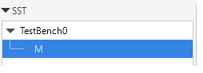
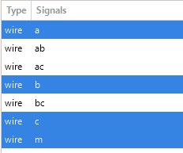
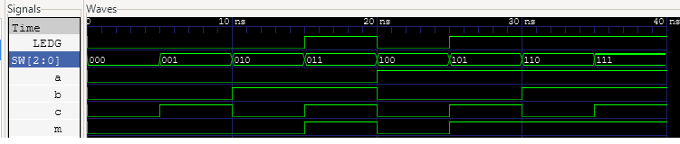

# Lab Setup Guide: Verilog Development with VS Code & Apio

Welcome to Digital Logic Design! In this course, we use **Visual Studio Code (VS Code)** paired with **Apio** to write, verify, and simulate Verilog code. 

This setup runs natively on **Windows, macOS (including M1/M2/M3 Apple Silicon), and Linux**. It matches our course autograder exactly, meaning if your code compiles and simulates correctly on your laptop, it will behave the same way when graded.

---

## 🛠️ Step 1: Install Visual Studio Code
If you do not already have it, download and install VS Code for your operating system:
* **Download Link**: [https://visualstudio.com](https://visualstudio.com)

---

## 📦 Step 2: Install Python
Apio relies on Python to manage its backend tools. 
1. **Download Link**: [https://python.org](https://python.org) (Download the latest stable version).
2. **CRITICAL STEP FOR WINDOWS USERS**: During the installation wizard, you **MUST** check the box that says **"Add python.exe to PATH"** before clicking install. If you miss this, Apio will not work.

---

## ⚙️ Step 3: Install Apio and Toolchains
We will install Apio and its required compilers (`iverilog` and `GTKWave`) directly inside VS Code.

1. Open **VS Code**.
2. Click on the **Extensions** icon on the left sidebar (or press `Ctrl+Shift+X` on Windows, `Cmd+Shift+X` on Mac).
3. Search for **"Apio"** (by fpgawars) and click **Install**.
4. Once installed, look at the bottom status bar or open the command palette (`Ctrl+Shift+P` or `Cmd+Shift+P`).
5. Run the following command to download the compiler and simulator toolchains:
   ```bash
   apio install --all
   ```
   *Note: This download may take a few minutes. A success message will appear in your terminal when finished.*

---

## 🚀 Step 4: Your First Simulation (Quick Test)

To make sure everything is installed correctly, let's create a simple AND gate logic module and test it.

### 1. Create a Project Folder
Create a brand new, empty folder on your computer named `Project0`. Open this folder in VS Code (`File` -> `Open Folder`).

### 2. Write the top-level module (`Project0.v`)
Create a new file named `Project0.v` and paste the following code:
```verilog
// File Name: Project0.v
module Project0
(
    input  [2:0] SW,    // a, b, c
    output [0:0] LEDG   // m
);
    Majority M(.m(LEDG[0]), .b(SW[2]), .a(SW[1]), .c(SW[0]));
endmodule
```
### 3. Write the Logic Hardware (`Majority.v`)
Create a new file named `Majority.v` and paste the following code:
```verilog
// File Name: Majority.v
module Majority (
    input  a, b, c,
    output m
);
    wire ab, ac, bc;
    and a1(ab, a, b);
    and a2(ac, a, c);
    and a3(bc, b, c);
    or  o1(m, ab, ac, bc);
endmodule
```

### 3. Write the Simulation Testbench (`Project0_tb.v`)
Create a second file named `Project0_tb.v`. This file tells the simulator what inputs to inject so you can watch the output change. Paste this code:
```verilog
// File Name: Project0_tb.v
`timescale 1 ns/1 ns
module TestBench0();
    reg  [2:0] SW;
    wire [0:0] LEDG;

    Majority M(.a(SW[2]), .b(SW[1]), .c(SW[0]), .m(LEDG[0]));

    initial begin
        $dumpvars(0, TestBench0);
        SW = 3'b000; #5;
        SW = 3'b001; #5;
        SW = 3'b010; #5;
        SW = 3'b011; #5;
        SW = 3'b100; #5;
        SW = 3'b101; #5;
        SW = 3'b110; #5;
        SW = 3'b111; #5;
    end
endmodule
```

### 4. Run the Verification & Simulation
Open the VS Code built-in terminal (`Terminal` -> `New Terminal`) and run these two commands:

* **Create an ini file (we will change this step later in the course):**
  ```bash
  apio create --board icestick
  ```

* **To check for syntax errors:**
  ```bash
  apio lint
  ```
* **To run the simulation and view waveforms:**
  ```bash
  apio sim
  ```

If successful, **GTKWave** will automatically pop open on your screen! 

---

## 📈 Step 5: Viewing Your Waveforms in GTKWave
When GTKWave opens, it will look blank at first. Follow these quick steps to see your signals:
1. In the top-left **SST** panel, click on `TestBench0->M`. 

    

2. In the panel below it, you will see your signals/wires: `a`, `b`, `c`, `m`, etc.

    
3. Select the signals `a`, `b`, `c`, and `m`(hold `Ctrl` or `Cmd` to click multiple), then click the **Append** button at the bottom left.

    
4. Click the **Zoom Fit** icon (magnifying glass with an "all" box) in the top toolbar to see your complete timing diagram!

---

## 🛑 Common Troubleshooting
* **Error: "apio command not found"**: Restart VS Code completely. If it still fails, your Python installation was not added to your system PATH. Re-run the Python installer and ensure the "Add to PATH" checkbox is clicked.
* **GTKWave opens but is completely empty**: Make sure your `_tb.v` file contains the exact `$dumpfile` and `$dumpvars` lines shown in the example above. Without them, no waveform data is saved for GTKWave to display.
