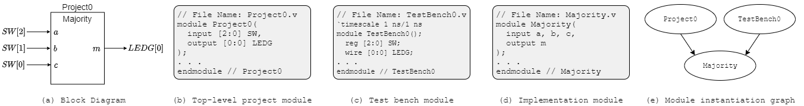

# Project 0: Majority (Tutorial)

This tutorial walks through entering, compiling, simulating, and testing a simple Verilog design. Unlike later projects, all source files are provided complete so you can practice the workflow.

# Starter Files
- [Project0.v](./assets/Project0.v)
- [Project0_tb.v](./assets/Project0_tb.v)
- [Majority.v](./assets/Majority.v)


# Design Specification
Design a logic circuit that takes 3 binary inputs *a*, *b*, *c* and returns a binary output *m* that is `1` when two or more inputs are `1`. This is the **Majority** function over 3 inputs.



*Figure 1: Project 0 interface and module instantiation graph. `Majority` is instantiated by both `Project0` and `Project0_tb`.*

The design is split into three Verilog modules:

- **`Majority`:** implements the function in terms of formal inputs `a`, `b`, `c` and formal output `m`.
- **`Project0`:** top-level module that connects `Majority` to the DE2-115 board's switches and LED.
- **`Project0_tb`:** instantiates `Majority` for ModelSim simulation. Inputs are declared `reg` and outputs `wire` (covered later in the course).

This three-module structure (top-level `Project*`, `TestBench*`, and an implementation module) is the template every project in the course follows.

> **Module Instantiation Graph.** A Verilog *module* is the basic hardware unit. Complex designs are decomposed into multiple modules, and the relationships are shown in a *module instantiation graph*. An arrow from module A to module B means A instantiates a copy of B.

# Verilog Implementation

## Project0 Module

```verilog
// File Name: Project0.v
module Project0
(
    input  [2:0] SW,    // a, b, c
    output [0:0] LEDG   // m
);
    Majority M(.m(LEDG[0]), .b(SW[2]), .a(SW[1]), .c(SW[0]));
endmodule
```

- **Comments:** `//` for single-line, `/* ... */` for block comments.
- **Lines 3–6** declare the I/O. `SW` is a 3-bit input array (`SW[2:0]`); `LEDG` is a 1-bit output. Verilog requires both indices in a range declaration even when they are equal - `output [0] LEDG` is invalid.
- **Line 8** instantiates `Majority` as instance `M` and connects formals to actuals **by name** (`.formal(actual)`). The order of arguments doesn't matter with this syntax. Equivalent positional syntax: `Majority M(SW[2], SW[1], SW[0], LEDG[0]);`.

## Majority Module

The output is `m = a&b | a&c | b&c`. Two implementation styles produce the same circuit:

**Behavioral:**

```verilog
// File Name: Majority.v
module Majority (
    input  a, b, c,
    output m
);
    assign m = a && b || a && c || b && c;
endmodule
```

The `assign` keyword indicates `m` is a *combinational* signal - it's re-evaluated whenever any right-hand-side input changes (*continuous assignment*). This is **Behavioral Modeling**: specify the function with Boolean expressions.

**Structural** (a netlist of gates):

```verilog
// File Name: Majority.v
module Majority (
    input  a, b, c,
    output m
);
    wire ab, ac, bc;
    and a1(ab, a, b);
    and a2(ac, a, c);
    and a3(bc, b, c);
    or  o1(m, ab, ac, bc);
endmodule
```

Gate instantiations follow the template `<gate-type> instance-name (output, input_1, ..., input_n)`. **Gate types must be lowercase** - `AND`, `And`, etc. are not recognized.

## Project0_tb Module

```verilog
// File Name: Project0_tb.v
// File Name: Project0_tb.v
`timescale 1 ns/1 ns
module TestBench0();
    reg  [2:0] SW;
    wire [0:0] LEDG;

    Majority M(.a(SW[2]), .b(SW[1]), .c(SW[0]), .m(LEDG[0]));

    initial begin
        $dumpvars(0, TestBench0);
        SW = 3'b000; #5;
        SW = 3'b001; #5;
        SW = 3'b010; #5;
        SW = 3'b011; #5;
        SW = 3'b100; #5;
        SW = 3'b101; #5;
        SW = 3'b110; #5;
        SW = 3'b111; #5;
    end
endmodule
```

- **Line 2** sets the simulation **time scale**: 1 unit = 1 ns, with 1 ns resolution.
- **Argument list is empty** - testbenches are purely simulations and don't take I/O.
- Inputs to the device under test are declared `reg`; outputs are `wire`.
- The `initial begin ... end` block enumerates all 8 input combinations, applying each for 5 time units. ModelSim executes these sequentially.

# Simulation and Testing

<!--## ModelSim
Simulate your design in ModelSim before submitting. See the [ModelSim Quick Start](./modelsim.html) for step-by-step setup with this project.-->

## APIO
Simulate your design in APIO before submitting. See the [APIO Quick Start](./Getting-Started-With-APIO.html) for step-by-step setup with for a this example.


<!--## Local Simulation (alternative)
You can also simulate locally with iverilog and gtkwave/VaporView. See the [Local Simulation Tools Setup Guide](./simulation_tools.html).-->

## Autograder
Submit your code to the [EECS 270 Autograder]({{ site.data.config.links.autograder }}). The Autograder builds a testbench around your top-level module and a reference module, runs comparison tests, and reports one of:

- **Syntax errors:** fix in ModelSim before resubmitting.
- **Failed tests:** the Autograder shows the failing input pattern, the expected output, and your output. Reproduce in ModelSim, fix, and resubmit.
- **All tests pass:** verify the top-module on LabsLand. Resubmit to Autograder if you find issues.

## LabsLand Verification
After simulation passes, verify on a real DE2-115 board through LabsLand. See the [LabsLand Verification Guide](./labsland.html). The link to labsland is available on [Canvas](https://umich.instructure.com/courses/869904).
