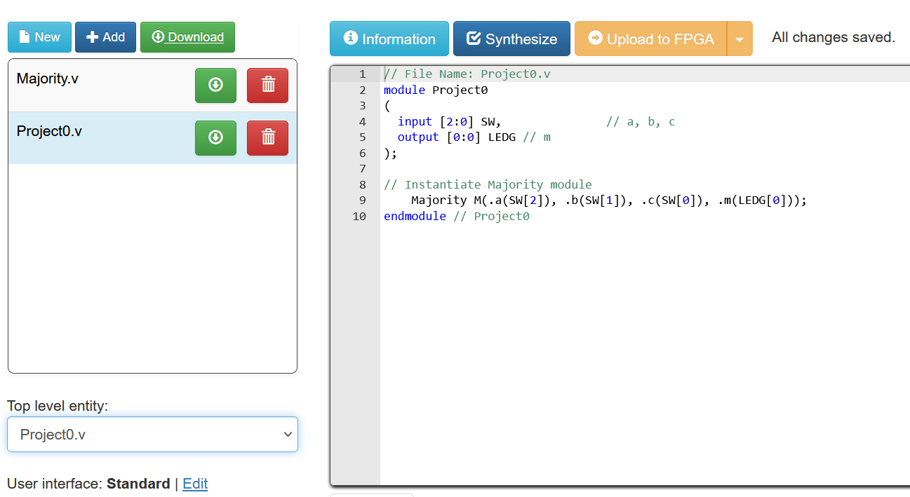
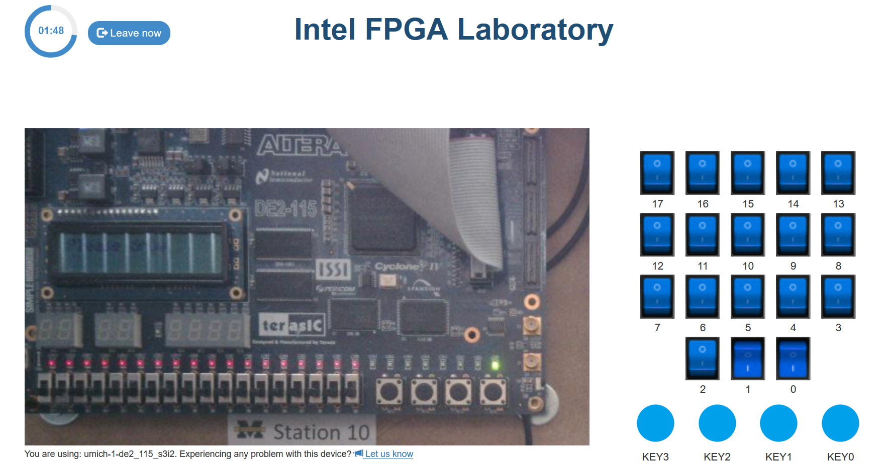

# LabsLand Verification

LabsLand provides remote access to a real DE2-115 board so you can verify your design on hardware before lab signoff. This page walks through verifying [Project 0](./p0_tutorial.html); the same steps apply to every project.

# Prerequisites
- A LabsLand account registered through the course join link (provided in lecture / on Canvas).
- A design that already simulates correctly in [ModelSim](./modelsim.html) or [iverilog](./simulation_tools.html). LabsLand time is limited to ~2 minutes, one of the reasons it isn't suitable for debugging.

# Steps

## 1. Log in and open the IDE

Log into LabsLand and click **DE2-115 IDE Verilog**.

## 2. Upload your files

Click **+Add** and upload the top-level module and all dependencies. For Project 0, upload `Project0.v` and `Majority.v`. **Do not** upload your testbench, as it may interfere with the synthesis process. LabsLand synthesizes for hardware, and testbenches are simulation-only.

## 3. Set top-level entity and synthesize

Make sure the top-level entity is `Project0`, then click **Synthesize**. Synthesis takes a moment; watch for errors in the log.

## 4. Upload to FPGA

Click **Upload to FPGA** to program the board.

## 5. Test interactively

For Project 0, toggle the switch icons for `SW[0]`, `SW[1]`, `SW[2]` and verify that `LEDG[0]` lights up exactly when two or more switches are on. Walk through the truth table to convince yourself the design is correct.

# Tips

- **LabsLand input quirks.** The web interface cannot register multiple simultaneous KEY presses with mouse clicks. Use the keyboard keys `0`–`3` to drive `KEY[0]`–`KEY[3]`. This matters for projects that read multiple keys at once (e.g., Project 3).
- **Active-low signals.** KEYs and HEX displays are active low. A pressed key reads `0`; a lit segment is driven to `0`.
- **If hardware behavior diverges from simulation,** check pin assignments in your top-level `Project*` module first. Most LabsLand-only failures are I/O mapping mistakes (wrong switch index, missing bit, swapped HEX outputs).
